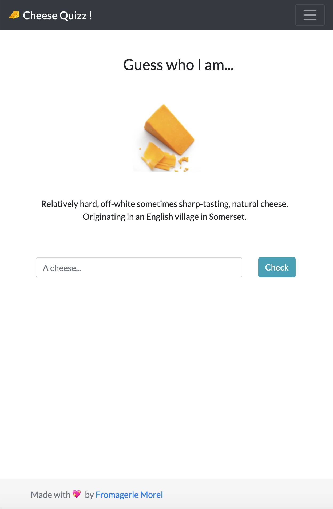
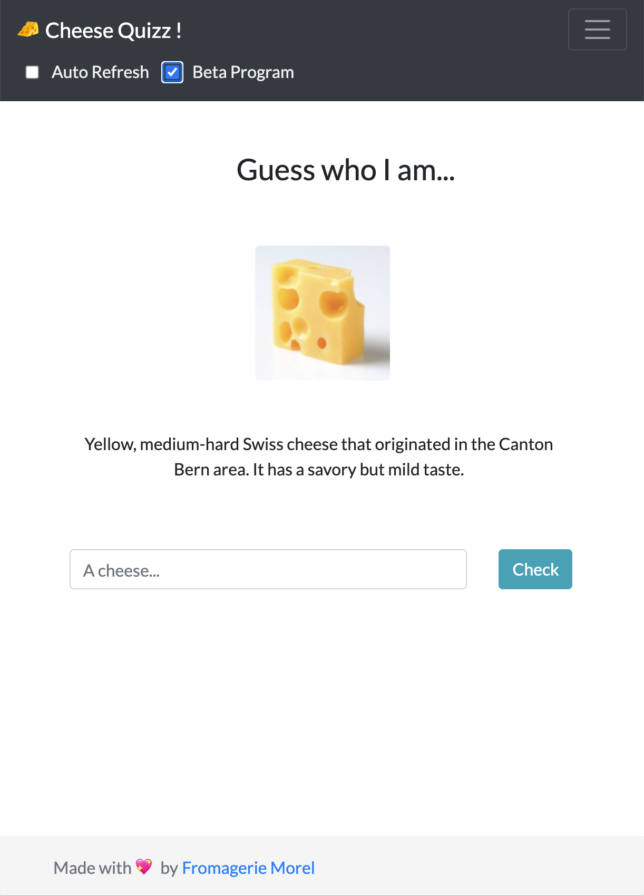

# cheese-quizz

A fun cheese quizz deployed on OpenShift and illustrating cloud native technologies like Quarkus, Istio Service Mesh, CodeReady Workspaces, Strimzi Kafka Operator, Fuse Online/Syndesis, Tekton pipelines and ArgoCD.


* **Part 1** Try to guess the displayed cheese! Introducing new cheese questions with Canaray Release and making everything resilient and observable using Istio Service Mesh. Deploy supersonic components made in Quarkus,

* **Part 2** Implement a new "Like Cheese" feature in a breeze using CodeReady Workspaces, demonstrate the inner loop development experience and then deploy everything using Tekton.

* **Part 3** Add the "Like Cheese API" using Serverless Knative and make it push new messages to Kafka broker. Use Syndesis or CamelK to deploy new integration services and create lead into Salesforce CRM ;-) 

## Start here for viewing the code

[](https://codeready-workspaces.apps.cluster-lemans-7d9e.lemans-7d9e.example.opentlc.com/f?url=https://github.com/lbroudoux/cheese-quizz)

## Cluster Setup

Please initialize and configure following operators in this order:

> All the components below can be setup using my `cluster-init.sh` script that you may find [here](https://github.com/lbroudoux/openshift-cases/tree/master/cluster-init/ocp-4.4).

* Istio Service Mesh deployed with `basic-install` on `istio-system` project
  * Take care of removing `LimitRanges` into `cheese-quizz` project

* Knative Serving deployed cluster wide
  * Create a `KnativeServing` CR into `knative-serving` project, adding `image-registry.openshift-image-registry.svc:5000` into `registriesSkippingTagResolving` property

* Fuse Online operator deployed into `fuse-online` project
  * Create a `SyndesisCRD` CR, calling it `syndesis`

* AMQ Streams operator deployed cluster wide,

* OpenShift Pipelines deployed cluster wide,

* CodeReady Workspaces operator deployed onto `workspaces` project with:
  * `quay.io/lbroudoux/che-plugin-registry:master` as the `pluginRegistryImage`
  * `true` for `tlsSupport`
  * `CHE_INFRA_KUBERNETES_PVC_WAIT__BOUND: 'false'` as `server.customCheProperties`

This is what the `CheCluster` custom resource shoud look like: 

```yml
apiVersion: org.eclipse.che/v1
kind: CheCluster
metadata:
  name: codeready-workspaces
  namespace: workspaces
spec:
  server:
    cheImageTag: ''
    cheFlavor: codeready
    devfileRegistryImage: ''
    pluginRegistryImage: 'quay.io/lbroudoux/che-plugin-registry:master'
    tlsSupport: true
    selfSignedCert: false
    customCheProperties:
      CHE_INFRA_KUBERNETES_PVC_WAIT__BOUND: 'false'
  database:
    externalDb: false
    chePostgresHostName: ''
    chePostgresPort: ''
    chePostgresUser: ''
    chePostgresPassword: ''
    chePostgresDb: ''
  auth:
    openShiftoAuth: true
    identityProviderImage: ''
    externalIdentityProvider: false
    identityProviderURL: ''
    identityProviderRealm: ''
    identityProviderClientId: ''
  storage:
    pvcStrategy: per-workspace
    pvcClaimSize: 1Gi
    preCreateSubPaths: true
```

## Demo setup

We need to setup the following resources for our demonstration:

* A `cheese-quizz` project for holding your project component
  * Make this project part of the Service Mesh control plane installed into `istio-system` by deploying a `ServiceMeshMemberRoll` into `istio-system` referencing `cheese-quizz` project as member

  * Once done, ensure `cheese-quizz` project has the following labels to be sure it is included into Service Mesh: 
    * `istio.io/member-of=istio-system`
    * `kiali.io/member-of=istio-system`

* A `cheese-quizz-function` project for holding the serverless part and the Kafka broker

* A `Kafka` broker CR into `cheese-quizz-function` letting the default properties
  * `oc create -f manifest/kafka.yml -n cheese-quizz-function`
  * `oc create -f manifest/kafka-topic.yml -n cheese-quizz-function`

Start deploying the components needed at the beginning of this demo, we'll deploy the other ones later on.

```
oc create -f manifests/quizz-question-deployment-v1.yml -n cheese-quizz
oc create -f manifests/quizz-question-deployment-v2.yml -n cheese-quizz
oc create -f manifests/quizz-question-deployment-v3.yml -n cheese-quizz
oc create -f manifests/quizz-question-service.yml -n cheese-quizz
oc apply -f manifests/quizz-question-destinationrule.yml -n cheese-quizz
oc apply -f manifests/quizz-question-virtualservice-v1.yml -n cheese-quizz
oc create -f manifests/quizz-client-buildconfig.yml -n cheese-quizz
oc create -f manifests/quizz-client-deploymentconfig.yml
oc create -f manifests/quizz-client-route.yml
oc rollout latest cheese-quizz-client
```

## Demonstration scenario

Once above commands are issued and everything successfully deployed, retrieve the Cheese Quzz route:

```
$ oc get route/cheese-quizz-client -n cheese-quizz |grep cheese-quizz-client |awk '{print $2}' 
cheese-quizz-client-cheese-quizz.apps.cluster-lemans-0014.lemans-0014.example.opentlc.com
```

and open it into a browser. You shoul get the following:



### OpenShift ServiceMesh demonstration

Introduce new `v2` questino using Canary Release and header-matching routing rules:

```
oc apply -f manifests/vs-cheese-quizz-question-virtualservice-v1-v2-canary.yml -n cheese-quizz
```

Using the hamburger menu on the GUI, you should be able to ubscribe the `Beta Program` and see the new Emmental question appear ;-) 



Now turning on the `Auto Refresh` feature, you should be able to visualize everything into Kiali, showing how turning on and off the Beta subscription has influence on the visualization of networks routes.


```
oc apply -f manifests/vs-cheese-quizz-question-virtualservice-v1-70-v2-30.yml -n cheese-quizz
```

```
oc apply -f manifests/vs-cheese-quizz-question-virtualservice-all.yml -n cheese-quizz
```

```
oc scale deployment/cheese-quizz-question-v2 --replicas=2 -n cheese-quizz
oc apply -f manifests/dr-cheese-quizz-question-cb -n cheese-quizz
```

```
oc apply -f manifests/dr-cheese-quizz-question-mtls -n cheese-quizz
```

```
oc scale deployment/cheese-quizz-question-v3 --replicas=2 -n quotegame
```

### CodeReady Workspaces demonstration

### OpenShift Pipelines demonstration

```
oc create -f manifests/oc-deploy-task.yml -n cheese-quizz
oc create -f manifests/oc-ensure-no-triggers.yml -n cheese-quizz
oc create -f manifests/oc-patch-deployment-task.yml -n cheese-quizz
oc create -f manifests/oc-start-build-task.yml -n cheese-quizz
oc create -f manifests/quizz-client-pipeline.yml -n cheese-quizz
oc create -f manifests/quizz-client-pipeline-trigger.yml -n cheese-quizz
oc create -f manifests/quizz-client-pipeline-listener.yml -n cheese-quizz
``` 

### OpenShift Serverless demonsration

### Fuse Online demonstration

$ oc -n argocd apply -f https://raw.githubusercontent.com/argoproj/argo-cd/v1.4.2/manifests/install.yaml


{"email":"david.clauvel@gmail.com","username":"David Clauvel","cheese":"Cheddar"}